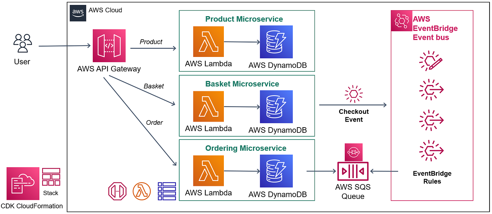
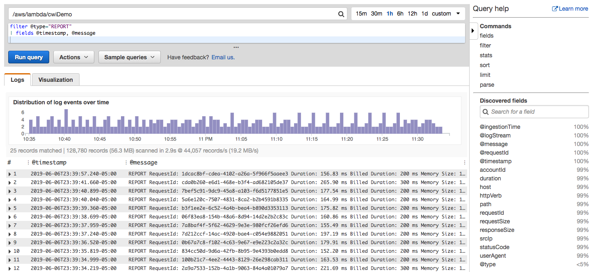

# 🚀 Serverless Architecture on AWS

This project demonstrates how to build a **serverless application on AWS** using core cloud services like AWS Lambda, API Gateway, DynamoDB, and SNS.

## 📌 Project Overview

This is a serverless architecture where:
- Users interact via a frontend/web request
- API Gateway handles requests
- AWS Lambda processes the logic
- DynamoDB stores data
- SNS sends notifications

Serverless architecture allows applications to run without managing servers, improving scalability and reducing cost.

## 🏗️ Architecture

## ⚙️ AWS Services Used

- **AWS Lambda** – Executes backend logic  
- **API Gateway** – Handles HTTP requests  
- **DynamoDB** – NoSQL database for storage  
- **SNS (Simple Notification Service)** – Sends alerts/notifications  
- **CloudFormation (Optional)** – Infrastructure as Code  

## 🔄 Workflow

1. User sends request via frontend/API  
2. API Gateway receives the request  
3. Lambda function processes the request  
4. Data is stored in DynamoDB  
5. SNS sends notification (email/alert)  

## 💡 Key Features

- Fully serverless (no server management)
- Auto scaling
- Cost-efficient (pay-as-you-go)
- Event-driven architecture
- Easy deployment using AWS

## 📊 Benefits

- High scalability  
- Reduced operational overhead  
- Faster deployment  
- Fault-tolerant system  

## 🧪 Testing

- Tested using API Gateway endpoints
- Verified Lambda execution logs via CloudWatch
- SNS email subscription confirmed

## 🧹 Cleanup

To avoid AWS charges:
- Delete CloudFormation stack / resources
- Remove Lambda, DynamoDB, SNS, API Gateway

## 📸 Output

## 🔗 Reference

Inspired from:
https://kevinkiruri.medium.com/serverless-architecture-on-aws-be3d6bd13f9a

## 🙌 Author

**Your Name**
- GitHub: https://github.com/yourusername
- LinkedIn: https://linkedin.com/in/yourprofile
